class: background,center,middle
#**Problem:context & background**

---
#People of the Niger Delta Suffer from Oil Spills for Over Fifty Years
```{r echo=FALSE, out.width='48%',fig.show='hold'}
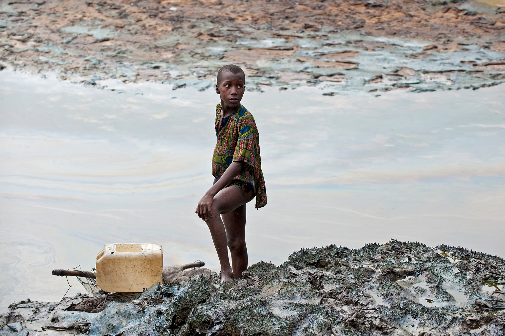
```
```{r echo=FALSE, out.width='48%',fig.show='hold'}
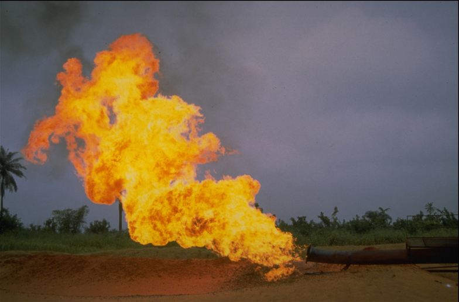
```
<center>Image credit: [As Shell, Eni quit Niger Delta, state-backed report describes legacy of carnage](https://news.mongabay.com/2023/05/as-shell-eni-quit-niger-delta-state-backed-report-describes-legacy-of-carnage/)
---
#Location
* The Niger Delta region, situated in **southern Nigeria**,is formed by the alluvial waters of the **Niger River**.
* The Niger Delta is the **largest wetland** in Africa and among the largest globally.This region spans approximately **70,000** square kilometers and has **diverse ecosystems**, including mangroves, swamps, and tropical rainforests.
```{r echo=FALSE,out.width='45%',out.height=='35%',fig.align='center'}
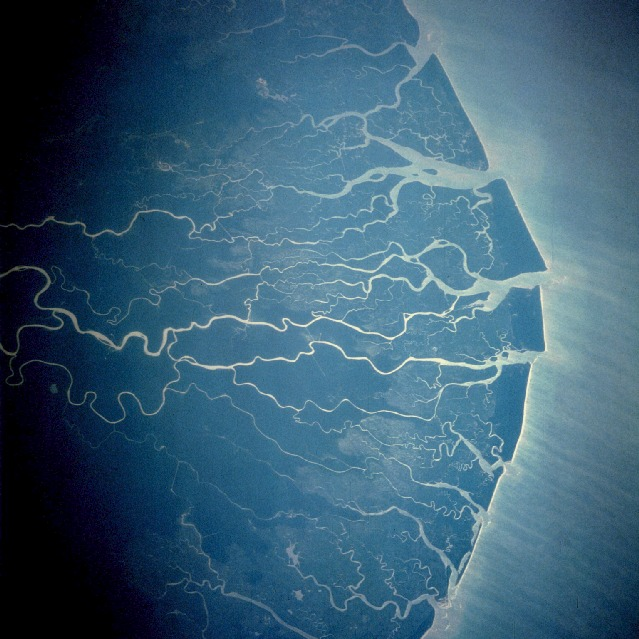
```
<center>Source:[Wikipedia-The Niger Delta](https://en.wikipedia.org/wiki/Niger_Delta)
---
#Problem statement
* Over the past 50 years, it's estimated that more than **1.5 million tons of oil** have spilled in the Niger Delta.

* Residential areas in **nine districts** of the delta suffer from **oil spills** every year due to **accidental discharges** and **operational spills**.

```{r echo=FALSE, out.width='60%',fig.align='center'}
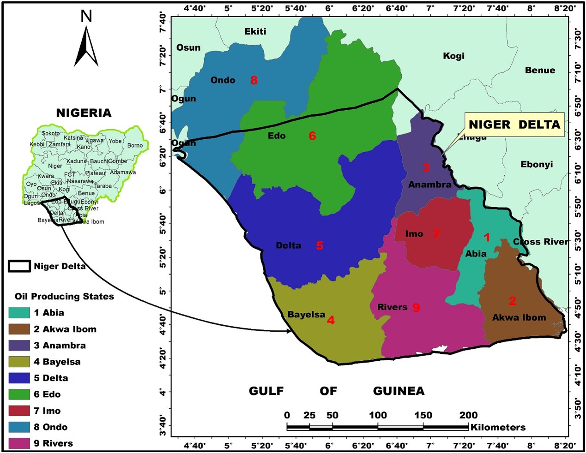
```
<center>Source:[Akinola S.,2020](https://www.sciencedirect.com/science/article/pii/S0269749120362333)
---
#Impact
<div class="tabs">
  <button class="tab-button" onclick="showContent('Environmental', event)">Environmental</button>
  <button class="tab-button" onclick="showContent('Economic', event)">Economic</button>
  <button class="tab-button" onclick="showContent('Social', event)">Social</button>
</div>
<div id="Environmental" class="tab-content">
  <ul>
    <li>Massive environmental degradation</li>
    <li>Vegetation removal</li>
    <li>Loss of biodiversity</li>
  </ul>
</div>

<div id="Economic" class="tab-content" style="display:none">
  <ul>
    <li>Agricultural lands therein have become unproductive</li>
    <li>Fishing unsustainable</li>
  </ul>
</div>

<div id="Social" class="tab-content" style="display:none">
  <ul>
    <li>The health hazards posed by nearby oil wells and facilities</li>
    <li>loss of jobs and heightened restiveness often ensue</li>
    <li>Triggered socio-environmental upheavals</li>
  </ul>
</div>
<script>
document.addEventListener("DOMContentLoaded", function() {
  // Default open tab
  showContent('Environmental');
});

function showContent(tabName, event) {
  var i, tabcontent, tabbuttons;
  tabcontent = document.getElementsByClassName("tab-content");
  for (i = 0; i < tabcontent.length; i++) {
    tabcontent[i].style.display = "none";
  }
  tabbuttons = document.getElementsByClassName("tab-button");
  for (i = 0; i < tabbuttons.length; i++) {
    tabbuttons[i].className = tabbuttons[i].className.replace(" active", "");
  }
  document.getElementById(tabName).style.display = "block";
  if (event) {
    event.currentTarget.className += " active";
  } else {
    // Set the first tab as active by default if no event is provided
    document.getElementsByClassName("tab-button")[0].className += " active";
  }
}
</script>
---
class: background,center,middle
###Therefore, we plan to use earth observation data to accurately detect the **distribution and concentration** of oil facilities in the Nigeria Delta region and monitor the **oil spill risk levels** in different areas. This allows us to respond to oil spills promptly and accurately and manage them effectively
---
class: background,center,middle
#**Policies**
---
#UN Sustainable Development Goals
.pull-left[
```{r echo=FALSE, out.width='30%'}
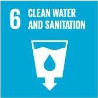
```
###Goal 6 
###CLEAN WATER AND SANITATION
Improve water quality by **reducing pollution**,eliminating dumping and minimizing release of hazardous chemicals and materials.
]
.pull-right[
```{r echo=FALSE, out.width='30%'}
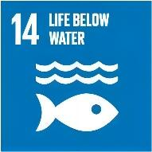
```
###Goal 14 
###LIFE BELOW WATER
Sustainably manage and protect marine and coastal ecosystems from **pollution**, as well as address the impacts of ocean acidification. 
]

<center>Source:[The 2030 Agenda for Sustainable Development](https://sdgs.un.org/goals)
---
#UNEP and Nigeria           
United Nations Environment Programme (UNEP) has conducted assessments and published reports on the environmental impacts of oil spills in Nigeria, particularly in the Niger Delta region. 

These reports, such as the 2011 Environmental Assessment of Ogoniland, provide valuable insights into the extent and consequences of oil pollution in the country.


```{r echo=FALSE,out.width='26%',fig.align='center'}
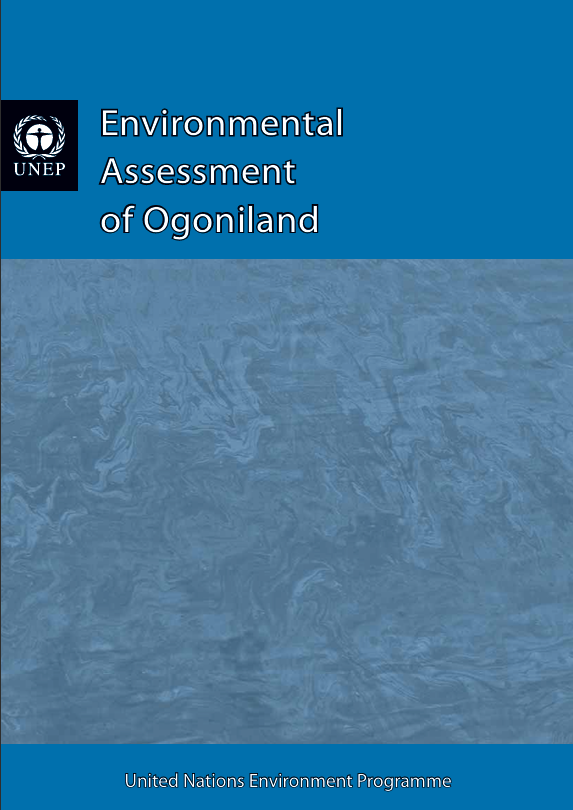
```
<center>Source:[UNEP](https://www.unep.org/resources/report/environmental-assessment-ogoniland)
---
#The Sendai Framework
The Sendai Framework focuses on the adoption of measures which address the **three dimensions of disaster risk** (exposure to hazards, vulnerability and capacity, and hazard’s characteristics) in order to **prevent the creation of new risk, reduce existing risk and increase resilience**.
- Priority 1: Understanding disaster risk

- Priority 2: Strengthening disaster risk governance to manage disaster risk  

- Priority 3: Investing in disaster risk reduction for resilience  

- Priority 4: Enhancing disaster preparedness for effective response and to "Build Back Better" in recovery, rehabilitation and reconstruction

<center>Source:[Sendai Framework for Disaster Risk Reduction 2015-2030](https://www.undrr.org/publication/sendai-framework-disaster-risk-reduction-2015-2030)
---
#The Sendai Framework
##Priority 1: Understanding disaster risk
- Policies and practices for disaster risk management should be based on an understanding of disaster risk in all its dimensions of **vulnerability, capacity, exposure of persons and assets, hazard characteristics and the environment**.

- Such knowledge can be leveraged for the purpose of **pre-disaster risk assessment**, for prevention and mitigation and for the development and implementation of appropriate preparedness and effective response to disasters.
---
#Oil Spill Response and Clean-up 

- Nigeria has a comprehensive legal and regulatory framework governing oil production and waste management, like the Petroleum Act, Oil Pipelines Act, EIA Act, NOSDRA Act, NESREA Act, NDDC Act, and DPR Guidelines and Standards. 

- However, the overall effectiveness still remains **limited** due to factors like **delayed response, inadequate resources, and insufficient technical expertise**.

```{r echo=FALSE,out.width='50%',fig.align='center'}
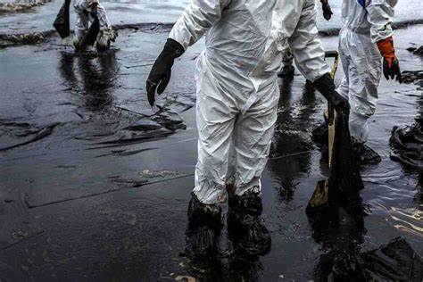
```
<center>Source:[NOSDRA](https://nosdra.gov.ng/)
---
#Oil Spill Response and Clean-up 
###The National Oil Spill Detection and Response Agency (NOSDRA) :the principal agency 
- Coordinate oil spill **preparedness, detection, response, and remediation efforts** across federal, state, and local government levels. 

- Enforce compliance with environmental regulations, conducting investigations into oil spills, and implementing measures to **prevent future incidents**. 

NOSDRA also works closely with **the Department of Petroleum Resources (DPR), the Nigerian Navy, and other relevant agencies **to detect, monitor, and respond to oil spill incidents. 
```{r echo=FALSE,out.width='30%',fig.align='center'}
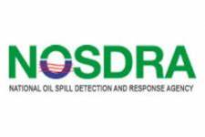
```
---
class:background,center,middle
#**Data and Methods**
---
##Geospatial data(for Geospatial modeling)
- Oil spill data
- Oil well data
- Oil pipelines data
- Data sets have been pre processed using R, consisting of some attributes plus a geometry column.

##EO data
- Land cover data(10m resolution) is extracted from a 2016 Sentinel-based map and validated by a 2006 FAO map
- SPOT 6 DEM and Imagery(20m resolution)

##Other
- The soil map is extracted from FAO's soil map and rasterized

---
class: middle
##Visualization
- GIS-based Kernel Density
- distribution and concentration of oil facilities
- a single map to visualize clustering and distribution 


<center>Source: Wang et al., 2022</center>
---

##Risk assessment
- GIS-based fuzzy logic model (FLM)
- five classes: Very High risk (VHR), High risk (HR), Moderate risk (MR), Low risk (LR), and Very Low risk (VLR)
###hazard map(1)
- oil facilities or oil well, flow station, terminal, and pipeline
###vulnerability map(2)
- land use/land cover, soil type, and topographic curvature
###risk assessment map(1+2)
- integration of the generated hazard and vulnerability maps

---
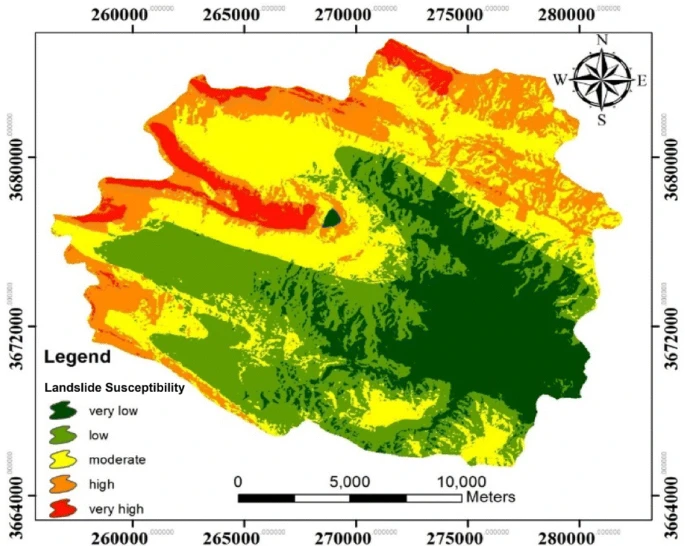
<center>Source: Baharvand et al., 2020</center>
---

class: background, middle, center
#**Timeline and Budget**
---

#Project Timeline
1. The project is scheduled to be completed in 12 weeks.

1. Project Management Institute (PMI) breaks down the project lifecycle into the following five phases of project management: initiation, planning, execution, monitoring and control, closure. 

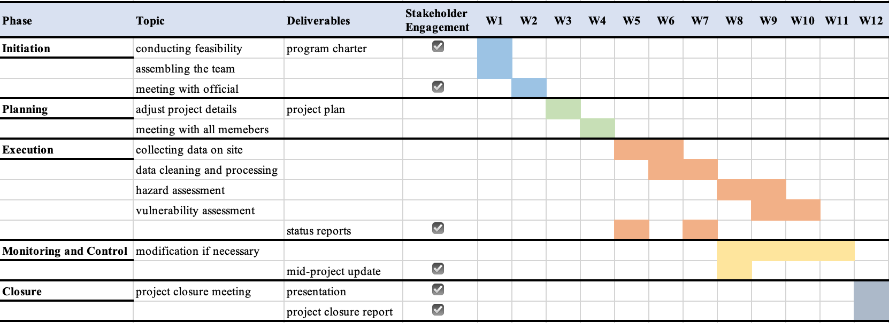
---

#Budget Breakdown

---
#Limitations & Mitigation
.pull-left[
##Limitations
* Secondary pollution caused by remediation measures
* Possible economic losses (due to reduced oil exports)
* political and legal obstacles
]

.pull-right[
##Mitigation
* environmentally sustainable cleanup strategies
* Economic diversification and increased social participation
* Strengthen communication with the government
]
---
class: background, middle, center
#**Summary**
---
#Summary
The Niger Delta has long suffered from the Dangers of oil spills, and the public has generally demanded effective oil spill management. However, efforts to contain these leaks are hampered by a lack of accurate and real-time information. Therefore, our goal is to use geospatial technology to accurately and timely identify and manage oil spills, providing targeted and effective methods to mitigate damage.

Impact of this project：
- Enhance the health and well-being of residents
- Stimulate economic development and create job opportunities
- Foster environmental sustainability and resilience
- promote social stability and enhance community safety
---
#References
“AN ENVIRONMENTAL GENOCIDE.” Report.bayelsacommission.org, Available at: https://report.bayelsacommission.org/.

“As Shell, Eni Quit Niger Delta, State-Backed Report Describes Legacy of Carnage.” Mongabay Environmental News, 16 May 2023, Available at: https://news.mongabay.com/2023/05/as-shell-eni-quit-niger-delta-state-backed-report-describes-legacy-of-carnage/

Baharvand, S. *et al.* (2020) ‘Landslide susceptibility zoning in a catchment of Zagros Mountains using fuzzy logic and GIS’, *Environmental Earth Sciences*, 79(10), p. 204.

Ebeku, K. S. (2007). Constitutional right to a healthy environment and human rights approaches to environmental protection in Nigeria: Gbemre v. Shell revisited. Review of European Community & International Environmental Law, 16(3), 312-320.

Edemadide, B. E. (2023). ENFORCEMENT OF REGULATORY STANDARDS FOR ENVIRONMENTAL PROTECTION IN NIGERIA: A LEGAL REVIEW. AJIEEL, 8(01), 41-56.
---
#References
Elenwo, E. I., & Akankali, J. A. (2014). Environmental policies and strategies in Nigeria oil and gas industry: gains, challenges and prospects. Natural Resources, 5(14), 884.

Ekott, Ini. “For Weary Niger Delta Residents, Shocking Oil Pollution Report Offers Little Hope.” Mongabay Environmental News, 16 May 2023, news.Available at: https://news.mongabay.com/2023/05/for-weary-niger-delta-residents-shocking-oil-pollution-report-offers-little-hope/

National Oil Spill Detection and Response Agency. (n.d.). Homepage. Retrieved March 16, 2024, from https://nosdra.gov.ng/

Konne, B. R. (2014). Inadequate monitoring and enforcement in the Nigerian oil industry: the case of shell and Ogoniland. Cornell Int'l LJ, 47, 181.

OLUJOBI, O. J., OLUJOBI, O. M., & Ufua, D. E. (2020). A critical appraisal of legal framework on deregulation of the downstream sector of the Nigerian Petroleum Industry.
---
#References
Udok, U., & Akpan, E. B. (2017). Gas flaring in Nigeria: Problems and prospects. Global Journal of Politics and Law Research, 5(1), 16-28.

United Nations Office for Disaster Risk Reduction. (2015). Sendai Framework for Disaster Risk Reduction 2015-2030. https://www.undrr.org/publication/sendai-framework-disaster-risk-reduction-2015-2030

United Nations Environment Programme. (2011). The 2011 Environmental Assessment of Ogoniland. https://www.unep.org/resources/report/environmental-assessment-ogoniland

United Nations. (2015). The 2030 Agenda for Sustainable Development. https://sdgs.un.org/goals

Wang, H. *et al.* (2022) ‘GIS-based analysis on the spatial patterns of global maritime accidents’, *Ocean Engineering*, 245, p. 110569. 

