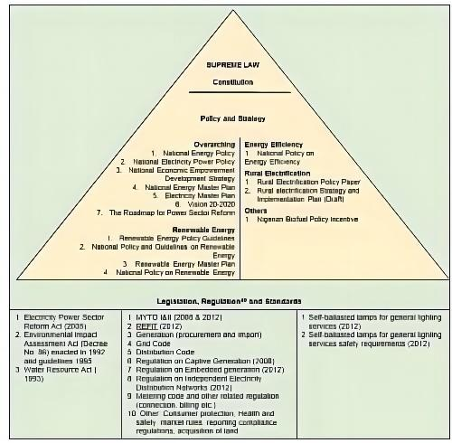

class: center,middle
#Problem:context & background
---
#People of the Niger Delta Suffer from Oil Spills for Over Fifty Years
```{r echo=FALSE, out.width='48%',fig.show='hold'}
knitr::include_graphics('image/oil-spill.jpg')
```
```{r echo=FALSE, out.width='48%',fig.show='hold'}
knitr::include_graphics('image/gas-flare.jpg')
```

<center>Image credit: [As Shell, Eni quit Niger Delta, state-backed report describes legacy of carnage](https://news.mongabay.com/2023/05/as-shell-eni-quit-niger-delta-state-backed-report-describes-legacy-of-carnage/)
---
#Location
* The Niger Delta region, situated in **southern Nigeria**,is formed by the alluvial waters of the **Niger River**.

* The Niger Delta is the **largest wetland** in Africa and among the largest globally.

```{r echo=FALSE,out.width='45%',out.height=='35%',fig.align='center'}
knitr::include_graphics('image/STS61C-42-72.jpg')
```
<center>Source:[Wikipedia-The Niger Delta](https://en.wikipedia.org/wiki/Niger_Delta)
---
#Problem statement
* Over the past 50 years, it's estimated that more than **1.5 million tons of oil** have spilled in the Niger Delta.

* Residential areas in **nine districts** of the delta suffer from **oil spills** every year due to **accidental discharges** and **operational spills**.

```{r echo=FALSE, out.width='60%',fig.align='center'}
knitr::include_graphics('image/niger 1.jpg')
```
<center>Source:[Akinola S.,2020](https://www.sciencedirect.com/science/article/pii/S0269749120362333)

---
#Impact

##Environmental
- Massive environmental degradation
- Loss of biodiversity
- Vegetation removal

##Economic
- Agricultural lands therein have become unproductive
- Fishing unsustainable

##Social
- The health hazards posed by nearby oil wells and facilities
- The deplorable state of the natural environment further depreciates the standard of living of the Niger Delta inhabitants
- Triggered socio-environmental upheavals
---
class: center,middle
#Policies
---
#UN Sustainable Development Goals
.pull-left[
```{r echo=FALSE, out.width='30%'}
knitr::include_graphics('image/UN6.jpg')
```
###Goal 6 
###CLEAN WATER AND SANITATION
Improve water quality by **reducing pollution**,eliminating dumping and minimizing release of hazardous chemicals and materials.
]
.pull-right[
```{r echo=FALSE, out.width='30%'}
knitr::include_graphics('image/UN14.jpg')
```
###Goal 14 
###LIFE BELOW WATER
Sustainably manage and protect marine and coastal ecosystems from **pollution**, as well as address the impacts of ocean acidification. 
]
---
#UNEP and Nigeria           
United Nations Environment Programme (UNEP) has conducted assessments and published reports on the environmental impacts of oil spills in Nigeria, particularly in the Niger Delta region. 

These reports, such as the 2011 Environmental Assessment of Ogoniland, provide valuable insights into the extent and consequences of oil pollution in the country.


```{r echo=FALSE,out.width='30%',fig.align='center'}
knitr::include_graphics('image/UNEP-2011.jpg')
```

---
#The Sendai Framework
The Sendai Framework focuses on the adoption of measures which address the **three dimensions of disaster risk** (exposure to hazards, vulnerability and capacity, and hazard’s characteristics) in order to **prevent the creation of new risk, reduce existing risk and increase resilience**.
- Priority 1: Understanding disaster risk

- Priority 2: Strengthening disaster risk governance to manage disaster risk  

- Priority 3: Investing in disaster risk reduction for resilience  

- Priority 4: Enhancing disaster preparedness for effective response and to "Build Back Better" in recovery, rehabilitation and reconstruction

---
#The Sendai Framework
##Priority 1: Understanding disaster risk
- Policies and practices for disaster risk management should be based on an understanding of disaster risk in all its dimensions of **vulnerability, capacity, exposure of persons and assets, hazard characteristics and the environment**.

- Such knowledge can be leveraged for the purpose of **pre-disaster risk assessment**, for prevention and mitigation and for the development and implementation of appropriate preparedness and effective response to disasters.
---
#Oil Spill Response and Clean-up 

```{r echo=FALSE,out.width='60%',fig.align='center'}

```
---
#Oil Spill Response and Clean-up 

- Nigeria has a comprehensive legal and regulatory framework governing oil production and waste management, like the Petroleum Act, Oil Pipelines Act, EIA Act, NOSDRA Act, NESREA Act, NDDC Act, and DPR Guidelines and Standards. 

- However, the overall effectiveness still remains **limited** due to factors like **delayed response, inadequate resources, and insufficient technical expertise**.

```{r echo=FALSE,out.width='50%',fig.align='center'}
knitr::include_graphics('image/OIP.jpg')
```
---
#Oil Spill Response and Clean-up 
###The National Oil Spill Detection and Response Agency (NOSDRA) :the principal agency 
- Coordinate oil spill **preparedness, detection, response, and remediation efforts** across federal, state, and local government levels. 

- Enforce compliance with environmental regulations, conducting investigations into oil spills, and implementing measures to **prevent future incidents**. 

NOSDRA also works closely with **the Department of Petroleum Resources (DPR), the Nigerian Navy, and other relevant agencies **to detect, monitor, and respond to oil spill incidents. 
```{r echo=FALSE,out.width='30%',fig.align='center'}
knitr::include_graphics('image/NOSDRA.jpg')
```
---
class: center,middle
#Data and Methods
---
##Geospatial data
- Oil spill data
- Oil well data
- Oil pipelines data

##EO data
- Land cover data(10m resolution)
- SPOT 6 DEM and Imagery(20m resolution)

##Other
- soil map data

---
class: middle
##Visualization
- GIS-based Kernel Density
- distribution and concentration of oil facilities
- a single map to visualize clustering and distribution 


<center>(source: Wang et al., 2022)</center>
---
##Risk assessment
- GIS-based fuzzy logic model (FLM)
- five classes: Very High risk (VHR), High risk (HR), Moderate risk (MR), Low risk (LR), and Very Low risk (VLR)
###hazard map
- oil facilities or oil well, flow station, terminal, and pipeline
###vulnerability map
- land use/land cover, soil type, and topographic curvature
###risk assessment map
- integration of the generated hazard and vulnerability maps

---

<center>(source: Baharvand et al., 2020)</center>
---

class: background, middle, center
#**Timeline and Budget**
---

#Project Timeline
1. The project is scheduled to be completed in 12 weeks.

1. Project Management Institute (PMI) breaks down the project lifecycle into the following five phases of project management: initiation, planning, execution, monitoring and control, closure. 


---

#Budget Breakdown

---

class: background, middle, center
#**Summary**

---

#References
Baharvand, S. *et al.* (2020) ‘Landslide susceptibility zoning in a catchment of Zagros Mountains using fuzzy logic and GIS’, *Environmental Earth Sciences*, 79(10), p. 204. Available at: https://doi.org/10.1007/s12665-020-08957-w.

Wang, H. *et al.* (2022) ‘GIS-based analysis on the spatial patterns of global maritime accidents’, *Ocean Engineering*, 245, p. 110569. Available at: https://doi.org/10.1016/j.oceaneng.2022.110569.

