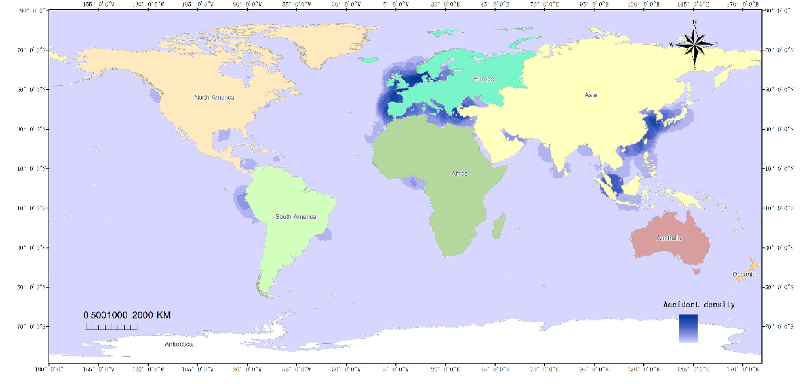

#UN Sustainable Development Goals
.pull-left[
##Goal 6 
###CLEAN WATER AND SANITATION
]
.pull-right[
##Goal 14 
###LIFE BELOW WATER
]
---
The Sendai Framework focuses on the adoption of measures which address the **three dimensions of disaster risk** (exposure to hazards, vulnerability and capacity, and hazard’s characteristics) in order to **prevent the creation of new risk, reduce existing risk and increase resilience**.
- Priority 1: Understanding disaster risk
- Priority 2: Strengthening disaster risk governance to manage disaster risk  
- Priority 3: Investing in disaster risk reduction for resilience  
- Priority 4: Enhancing disaster preparedness for effective response and to “Build Back Better” in recovery, rehabilitation and reconstruction

---
Priority 1: Understanding disaster risk
23. Policies and practices for disaster risk management should be based on an understanding of disaster risk in all its dimensions of vulnerability, capacity, exposure of persons and assets, hazard characteristics and the environment. Such knowledge can be leveraged for the purpose of pre-disaster risk assessment, for prevention and mitigation and for the development and implementation of appropriate preparedness and effective response to disasters.

---
#UNEP and oil spills in Nigeria
United Nations Environment Programme (UNEP) has conducted assessments and published reports on the environmental impacts of oil spills in Nigeria, particularly in the Niger Delta region. These reports, such as the 2011 Environmental Assessment of Ogoniland, provide valuable insights into the extent and consequences of oil pollution in the country.

---
class: inverse,center,middle
Unclear what information is used to guide responses.

---
#Current Semarang Resilience Strategy
The Petroleum Act, Oil Pipelines Act, EIA Act, NOSDRA Act, NESREA Act, NDDC Act, and DPR Guidelines and Standards. 
- Aim to prevent oil spills, ensure proper waste management, and hold oil companies accountable for their environmental performance. 
- However, the effectiveness of this regulatory framework is limited by factors such as weak enforcement, inadequate resources, and overlapping responsibilities among regulatory agencies.

---
#Local organizations

---
#Local organizations
Oil Spill Response and Clean-up The National Oil Spill Detection and Response Agency (NOSDRA) 
- Responsible for coordinating oil spill response and clean-up efforts in Nigeria. 
- Works closely with the Department of Petroleum Resources (DPR), the Nigerian Navy, and other relevant agencies to detect, monitor, and respond to oil spill incidents. 
- The overall effectiveness of oil spill response and clean-up in the Niger Delta region remains limited due to factors such as delayed response, inadequate resources, and insufficient technical expertise.
---
class: center,middle
#Data and Methods
---
##Geospatial data
- Oil spill data
- Oil well data
- Oil pipelines data

##EO data
- Land cover data(10m resolution)
- SPOT 6 DEM and Imagery(20m resolution)

##Other
- soil map data

---
class: middle
##Visualization
- GIS-based Kernel Density
- distribution and concentration of oil facilities
- a single map to visualize clustering and distribution 

(source: Wang et al., 2022)

---
##Risk assessment
- GIS-based fuzzy logic model (FLM)
- five classes: Very High risk (VHR), High risk (HR), Moderate risk (MR), Low risk (LR), and Very Low risk (VLR)
###hazard map
- oil facilities or oil well, flow station, terminal, and pipeline
###vulnerability map
- land use/land cover, soil type, and topographic curvature
###risk assessment map
- integration of the generated hazard and vulnerability maps

---

(source: Baharvand et al., 2020)

---

class: background, middle, center
#**Timeline and Budget**
---

#Project Timeline
1. The project is scheduled to be completed in 12 weeks.

1. Project Management Institute (PMI) breaks down the project lifecycle into the following five phases of project management: initiation, planning, execution, monitoring and control, closure. 

---

#Budget Breakdown

---

class: background, middle, center
#**Summary**

---

#References
Baharvand, S. *et al.* (2020) ‘Landslide susceptibility zoning in a catchment of Zagros Mountains using fuzzy logic and GIS’, *Environmental Earth Sciences*, 79(10), p. 204. Available at: https://doi.org/10.1007/s12665-020-08957-w.

Wang, H. *et al.* (2022) ‘GIS-based analysis on the spatial patterns of global maritime accidents’, *Ocean Engineering*, 245, p. 110569. Available at: https://doi.org/10.1016/j.oceaneng.2022.110569.

